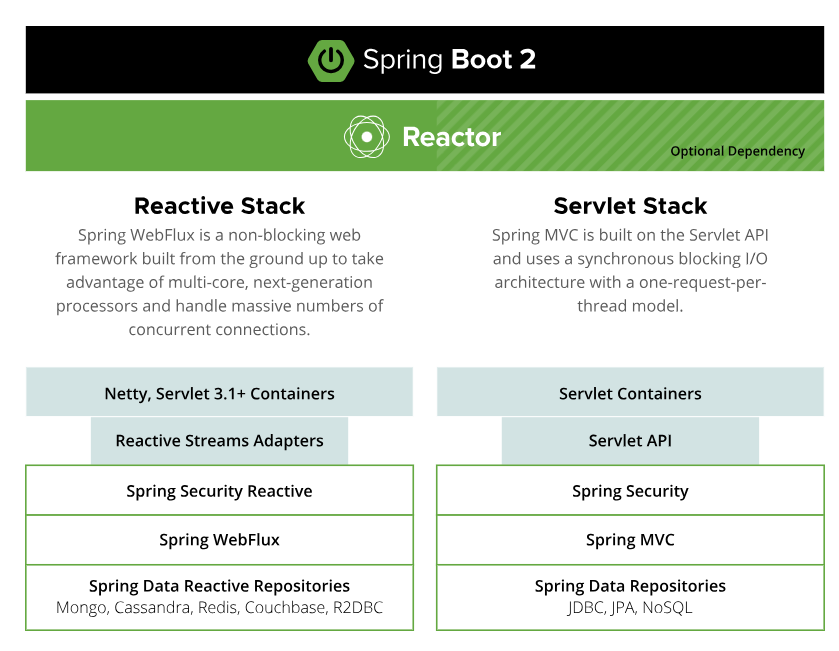

# Spring WebFlux 및 리액티브 스택에 대한 이해

## 1. WebFlux란?

**Spring WebFlux**는 비동기 및 논블로킹 웹 애플리케이션을 구축하기 위해 Spring Framework에서 제공하는 모듈이다. 이는 주로 리액티브 프로그래밍 모델을 기반으로 하며, CPU와 I/O 작업의 효율성을 극대화하는 데 중점을 둔다.

## 2. I/O Bound와 CPU Bound

- **I/O Bound**:
  - I/O 바운드 작업은 주로 네트워크, 파일 시스템, 데이터베이스와 같은 외부 리소스와의 상호작용에서 발생함.
  - 예를 들어, 네트워크 통신 시 패킷을 수신하는 동안 CPU는 대기 상태에 놓이게 된다. 이 경우 애플리케이션의 다른 동작이 멈추게 되므로, 비동기 및 논블로킹 방식이 필요하다.

- **CPU Bound**:
  - CPU 바운드 작업은 CPU의 연산 능력에 의해 제한된다. CPU 코어 수가 늘어나면 성능이 증가하는 경향이 있다.
  - 계산이나 복잡한 알고리즘 실행과 같은 CPU 집약적 작업이 포함된다.

## 3. 비동기 및 논블로킹의 필요성

- **성능 개선**:
  - I/O 작업을 비동기로 처리하면, CPU는 다른 작업을 수행하면서 대기 시간을 줄일 수 있음. 이를 통해 시스템 자원을 효율적으로 활용할 수 있음.

- **멀티스레드 환경**:
  - I/O 처리를 빠르게 하려면 멀티스레드를 사용하는 것이 일반적이다. 하지만, 스레드 간의 컨텍스트 스위칭이 발생할 수 있으며, 이는 성능 저하를 초래할 수 있음.
  - 스레드 부족 상황에서는 Out of Memory (OOM) 오류가 발생할 수 있으므로, 스레드 풀을 미리 확보하는 것이 중요하다.
  - Spring WebFlux에서는 최소 및 최대 스레드 수를 설정하여 스레드 풀을 관리할 수 있음.

## 4. Spring MVC vs. WebFlux

| 특성             | Spring MVC                     | Spring WebFlux                 |
|------------------|--------------------------------|--------------------------------|
| **프로그래밍 모델** | 동기적                         | 비동기적                       |
| **서블릿 API**    | Servlet API에 기반             | Servlet API에 의존하지 않음     |
| **I/O 처리**      | 블로킹                         | 논블로킹                       |
| **성능**          | 고정된 스레드 모델            | 높은 동시성 및 확장성          |
| **사용 사례**     | 전통적인 웹 애플리케이션        | 마이크로서비스 및 실시간 애플리케이션 |

- **Spring MVC**는 전통적인 블로킹 I/O 모델을 기반으로 하며, 모든 요청을 순차적으로 처리함. 이는 간단한 웹 애플리케이션에 적합하지만, 많은 동시 요청을 처리할 때 성능 저하가 발생할 수 있다.
- **Spring WebFlux**는 비동기 및 논블로킹 I/O를 활용하여 높은 동시성을 지원함. 이는 데이터 스트리밍 및 실시간 업데이트가 필요한 애플리케이션에 특히 유용하다.

- **reactive vs servlet**

    
    - 출처: [Spring Reactive](https://spring.io/reactive)

## 5. 리액티브 스택의 필요성

- **비동기 프로그래밍 모델**: 애플리케이션의 응답성을 향상시키며, 더 많은 요청을 처리할 수 있는 능력을 제공.
- **효율적인 자원 사용**: CPU 및 메모리 자원을 최적화하여 높은 성능을 유지할 수 있다.
- **유연성**: 리액티브 스트림 API를 통해 데이터 흐름을 제어할 수 있으며, 다양한 I/O 작업을 동시에 처리할 수 있다.
- **마이크로서비스 아키텍처와의 통합**: 리액티브 스택은 마이크로서비스와 잘 통합되어, 서비스 간의 통신에서 비동기적 방식으로 성능을 극대화.

## 6. 결론

Spring WebFlux와 리액티브 스택은 현대 웹 애플리케이션의 비동기 및 논블로킹 처리에 최적화되어 있다. 이를 통해 I/O 바운드 작업에서의 성능을 극대화하고, 시스템 자원을 효율적으로 관리할 수 있다. 이러한 특성 덕분에 리액티브 스택은 확장성이 뛰어난 애플리케이션 구축에 필수적임.